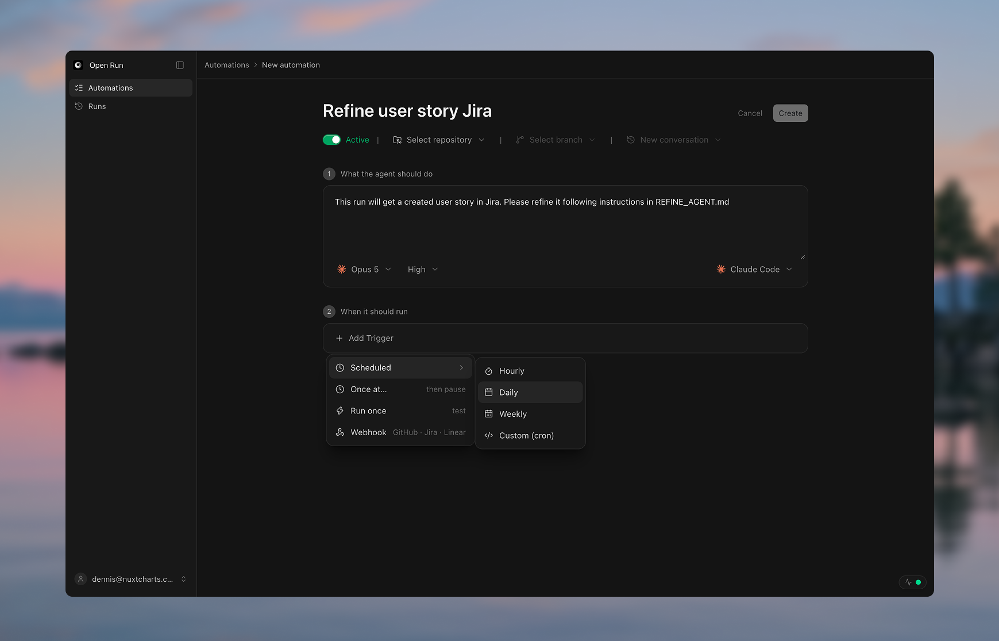

<div align="center">

# Open Run

**Schedule coding agents on your machine.**

Run Claude Code, Codex, Grok, Gemini, Antigravity and fx like cron jobs — no API keys,
no hosted runner, no account. Your repositories never leave your disk.

[](./LICENSE)
[](https://github.com/dennisadriaans/openrun/actions/workflows/ci.yml)
[](https://nodejs.org)



</div>

## Table of contents

- [What it is](#what-it-is)
- [Quick start](#quick-start)
- [Features](#features)
- [Runtimes](#runtimes)
- [Security](#security)
- [Development](#development)
- [Contributing](#contributing)
- [License](#license)

## What it is

Open Run drives the coding-agent CLIs you are already logged into. Point it at a local
git repository, write a prompt, and give it a trigger — a cron schedule, a webhook, or
one shot. A run is a conversation you can follow up on, and every turn snapshots git so
you can read the diff, undo it, or open a pull request.

It bills through the CLI subscription you already pay for. It holds no model API keys
and sends no prompt or file to a model provider itself.

## Quick start

```bash
git clone https://github.com/dennisadriaans/openrun.git
cd openrun
pnpm install
pnpm dev
```

Open <http://localhost:3000>.

1. **Add a project** — a local git repository — from Automations.
2. **New automation** — pick the project, write the prompt under Agent Instructions, Create.
3. **Run now**, and open the run to watch it stream.

### Requirements

- Node 22.6+ and pnpm 10+
- git
- At least one agent CLI logged in: `claude`, `codex`, `grok`, `agy`, `gemini` or `fx`
- macOS and Linux natively; Windows through WSL2
- `gh` only if you want pull requests

## Features

- **Triggers** — hourly, daily, weekly, a custom cron expression, a one-off at a set
  time, or a webhook from GitHub, GitLab, Bitbucket, Jira, Linear or Azure DevOps.
- **Per-run runtime** — Claude this run, Codex the next. The workspace is never locked
  to one agent.
- **Diff review** — every run ends in a file-by-file diff, not a wall of agent chatter.
- **Git actions** — commit, cut a branch, push, or open the pull request in one click;
  Undo All restores the snapshot taken when the run started.
- **Isolated worktrees** — a new automation defaults to its own git worktree under
  `~/.openrun`, on its own branch, so it never writes into the checkout your editor has
  open.
- **Supervised runs** — surface each tool call as Allow/Deny before it happens.
- **Local by default** — runs, prompts, transcripts and diffs live in a local SQLite
  file. Webhooks reach localhost over an outbound WebSocket to openrun.sh, so there is
  no ngrok, port forwarding or signing secret; that part is optional and everything else
  works signed out.

## Runtimes

| Runtime | Binary | Transport |
| --- | --- | --- |
| Claude Code | `claude` | CLI (stream-json) |
| Codex CLI | `codex` | CLI (`codex exec`) |
| Grok CLI | `grok` | CLI (streaming-json) |
| Antigravity CLI | `agy` | CLI (stream-json) |
| Gemini CLI | `gemini` | CLI headless, or ACP |
| fx | `fx` | ACP |

Adding your own is a preset, not a fork — see
[adding a runtime](https://openrun.sh/docs/adding-a-runtime).

## Security

> [!WARNING]
> **Open Run runs agent CLIs with your credentials in directories you choose.** Anyone
> who can reach its HTTP server can run commands as you. It binds `127.0.0.1` and
> refuses to start on a public interface without an access token. Start with read-only
> prompts.

Full model and vulnerability reporting: [SECURITY.md](./SECURITY.md).

## Development

```bash
pnpm dev            # app on :3000
pnpm dev -- --demo  # sample Runs + Automations, no DB writes
pnpm test
pnpm typecheck
pnpm build
```

Architecture and module boundaries: [AGENTS.md](./AGENTS.md) and
[openrun.sh/docs/architecture](https://openrun.sh/docs/architecture).

### Keeping it running

Cron only fires while Open Run is running, so a terminal tab is not where a
scheduler should live. Build it and run it as a background service:

```bash
pnpm build
pnpm start          # serves the build; refuses an unsafe bind
```

Templates for launchd (macOS) and systemd (Linux) are in
[`contrib/service/`](./contrib/service/) — they survive logout and restart the
app if it dies. Open Run recovers a fire missed in the last fifteen minutes on
start-up and records older ones as visible misses, but nothing beats being up.

> Open Run is experimental and in active development.

## Contributing

Issues and pull requests are welcome — start with [CONTRIBUTING.md](./CONTRIBUTING.md).
Contributors sign the [CLA](./CLA.md). Please also read the
[Code of Conduct](./CODE_OF_CONDUCT.md).

## License

[GNU AGPLv3](./LICENSE). Everything that runs on your machine is open source and stays
that way. Teams that cannot ship AGPL: [COMMERCIAL-LICENSE.md](./COMMERCIAL-LICENSE.md).
