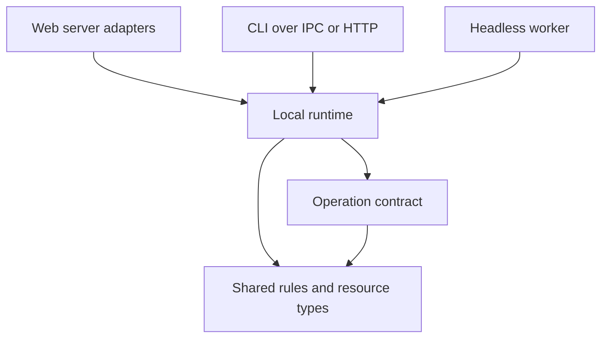

# Open Run architecture

Open Run has several clients and one local execution engine. The workspace separates
those clients from the rules and runtime they share, without introducing a second
scheduler, database, permission system or API definition.

## Package map

| Location | Owns | Depends on |
| --- | --- | --- |
| `apps/web` | TanStack routes, React UI, feature queries, HTTP adapters, web startup | Domain, contracts, server-only runtime exports |
| `apps/cli` | Terminal session, input, commands, IPC and optional HTTP client | Domain, contracts, lightweight runtime adapters; ships the worker |
| `apps/worker` | Headless startup and stdio MCP executable | Runtime, domain |
| `packages/runtime` | Application capabilities, execution, SQLite, filesystem, integrations | Domain, contracts, Node dependencies |
| `packages/domain` | Shared rules, persisted resource types, ACP events, protocol constants | `cron-parser` for schedule calculations; no React or Node IO |
| `packages/contracts` | Operation descriptors, TypeScript client and OpenAPI | Domain validation types |
| `packages/apple/OpenRunKit` | Swift HTTP/SSE client and generated operation types | Apple platform libraries; the HTTP contract |
| `scripts` | Build, generation, checks and releases; compatible root launchers | Package exports and build tools |



Browser components import shared rules directly for immediate validation, and use
feature queries for server work. A generated server function imports the dispatcher
lazily inside the server boundary. SQLite and process APIs must never enter the
browser dependency graph. The standalone CLI does not import the web app.

## Where to change a feature

| Work | Start here |
| --- | --- |
| A screen or component | `apps/web/src/features/<feature>/` and its route in `apps/web/src/routes/` |
| Query keys, fetching, optimistic updates or invalidation | The feature's `queries.ts`; `lib/queries.ts` retains compatibility exports |
| CLI command or natural request parsing | `apps/cli/src/commands/` |
| CLI rendering, keys or suggestions | `apps/cli/src/terminal/` |
| CLI timeline and live activity | `apps/cli/src/session/` |
| Worker connection and lifecycle | `apps/cli/src/runtime/local.ts`, `apps/worker/src/index.ts` |
| Automation reads and readiness | `packages/runtime/src/application/taskQueries.ts` |
| Automation writes and scheduling commands | `packages/runtime/src/application/taskCommands.ts` |
| Chat, run, git, MCP or integration use cases | The corresponding module in `packages/runtime/src/application/` |
| Process startup and single-owner recovery | `packages/runtime/src/bootstrap.ts` and `process/localRuntime.ts` |
| SQLite storage or additive migrations | `packages/runtime/src/storage/db.ts` |
| Resource shapes used by clients | `packages/domain/src/entities.ts` |
| Shared disable/refusal rules | `packages/domain/src/tasks/`, `runs/`, `workspaces/`, `security/` |
| Add or scope an API operation | `packages/contracts/src/operations/<capability>.ts` |
| Native Apple transport behavior | `packages/apple/OpenRunKit/Sources/OpenRunKit/` |

## Extension rules

The architecture uses functional capability modules and adapters. A feature does
not need a class, repository interface, service container or a new inheritance
hierarchy merely to fit the layout.

1. Implement a capability in the runtime's `application/` directory. Compose the
   lower-level execution, storage and provider modules; do not import `core.ts`
   back into a feature. Keep initialization in `bootstrap.ts`.
2. Put any rule a client must also evaluate in the relevant domain module. Keep
   filesystem, SQLite, environment lookup and process work in the runtime. The
   existing `openrunEnv.ts` module remains the single environment-value seam.
3. Export the public operation through `core.ts`, and add its descriptor to the
   appropriate contract feature. A new contract group is registered once in
   `operations.ts`. Existing dispatch, validation, permission scoping and transport
   generators then handle it without a new branch for each client.
4. Run `pnpm contract:generate`. Never hand-edit the generated web functions,
   TypeScript fetch client, OpenAPI document or Swift operations. Wire the web query
   in its owning feature; the CLI can use the same operation through IPC or HTTP.
5. Run the checks below. For new refusal conditions, cover the shared gate and the
   server path so a disabled action and the actual operation agree.

Use explicit `.ts`/`.tsx` extensions for relative source imports. Cross-package
imports use declared `@openrun/...` exports. Runtime exports are explicit, so a
consumer cannot accidentally reach an arbitrary implementation file. Type-only
runtime imports are erased; value imports in the web app are limited to server
entry points, API routes, and the lazy generated-function/auth boundaries.

`pnpm architecture:check` enforces those directions, checks manifest dependencies
and exported targets, and rejects cycles between application capability modules.
The operation registry tests and dispatch tests protect operation ids, routes,
input validation, mobile scopes and facade wiring.

## Development and verification

Use the Node and pnpm versions declared in the root `package.json`. The root
version is the release source of truth; private workspace packages are not
published independently.

```sh
pnpm install --frozen-lockfile
pnpm dev
pnpm cli --help
pnpm --filter @openrun/web dev
pnpm --filter @openrun/worker start

pnpm architecture:check
pnpm contract:check
pnpm lint
pnpm typecheck
pnpm test
pnpm build
pnpm cli:package
pnpm cli:smoke
swift test --package-path packages/apple/OpenRunKit
```

`pnpm build` emits `apps/web/dist/client` and `apps/web/dist/server`; `pnpm start`
finds the web build there (and accepts the former root output as a fallback).
Keeping the output inside the web workspace lets Node resolve its dependencies
without root-level hoisting. The CLI package bundles internal packages into `dist/npm/bin` and derives
its external runtime dependencies from the emitted imports. `cli:smoke` packs and
installs that package in a temporary directory, reuses the standalone integration
suite, and checks the MCP helper. It does not use the user's database or agents.

Root `scripts/openrun.ts`, `worker.ts`, `mcp-server.ts`, `dev.ts`, `start.ts` and
`token.ts` remain small compatibility launchers for existing commands, service
configuration and tool integrations. `OPENRUN_HOME`, database locations, wire ids,
HTTP routes, environment variables and scheduling behavior are unchanged.

CI checks the architecture and generated contract, then lint, types, tests and the
web build. It also installs and tests the packaged CLI on Linux and runs the Swift
package tests on macOS.

## Private parent and iOS app

This public repository can remain the `app/` checkout inside the private
`agentic-automation` parent. There is no reason to move that git boundary as part
of reorganizing its internals.

The actual private iOS app is not present in this repository. Keep native app
source in the private parent (a future `apps/ios/` move must update its Xcode
project there), and reference the shared SDK at
`app/packages/apple/OpenRunKit`. Do not copy the Swift SDK or reimplement the
server's rules in the iOS app. An app at the public workspace's `apps/ios` would
use `../../packages/apple/OpenRunKit` relative to that directory.

The SDK has moved from `clients/apple/OpenRunKit` to `packages/apple/OpenRunKit`.
A compatibility symlink keeps existing private Xcode package references working.
New references should use the package location. No private iOS sources have been
moved or published by this change.
